#### 比较大的一个收获

在逻辑比较复杂的时候 ,一定要先画出 ,流程图之后,分析一下有没有 什么逻辑上的错误,再去

编码,这是十分要记住的一个点!


#### 验证码登录和注册(redis 实现 session 共享问题)


- 可以 在添加一些 额外的 验证， 比如 验证码 如片的显示（防止恶意注册这种!）(手机验证码登录，应该不需要这个吧！)


- 当前的黑马项目没有使用第三方 信息的登录，而是自己发送验证码
  - 当前有一个问题是需要注意的，就是  使用了 session ，那么集群间 数据怎么 共享？？？
  - 这个问题要留意一下：
  - [(87条消息) 4种分布式session解决方案_断橋殘雪的博客-CSDN博客_分布式session](https://blog.csdn.net/qq_35620501/article/details/95047642)
  - 基于redis 的session 方案，好像是主流的应用
  - 注意这个项目 基于redis 来实现session的 细节处理 ，真的很妙


- ```
  # session 的钝化 和 活化， 原来 不仅 在 服务器 关闭 和开启时 会 钝化和  活化
  
  # 还有下面的作用！ （这一点 设计的还是挺不错的！） 
  便于保持用户的状态，就需要在WEB容器中存储有大量的用户session信息，但是随着并发访问用户的增多，此种保存模式必然会带来较大的内存占用，而导致频繁的GC操作，从而影响服务器的处理性能，为了解决这一问题，JavaWEB提供了session的序列化管理机制，可以将暂时不活跃的session信息保存到其对应的二进制文件之中（此操作称为“钝化”），而后再需要的时候可以根据SessionID通过磁盘恢复对应的Session数据（此操作称为“激活”），这样就可以极大的减少服务器内存占用的问题，从而实现较高的服务器处理性能。
  
  
  ```

- 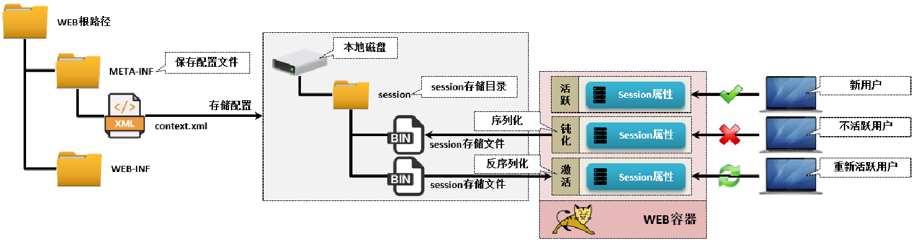


- [(87条消息) java web 项目中实现短信验证码登录，注册_cyf__wlp的博客-CSDN博客_javaweb验证码登录](https://blog.csdn.net/qq_35210105/article/details/105993842)
- 上面这个链接是 关于第三方短信服务的接入 ，其实没什么难度的
  - 引入 maven 依赖
  - 写配置（一般会让写 个人在当前平台的 密钥和 id）
  - coding


- 敏感信息的处理（所以为什么需要一个 DTO 对象，这里就很好的说明了）
  - 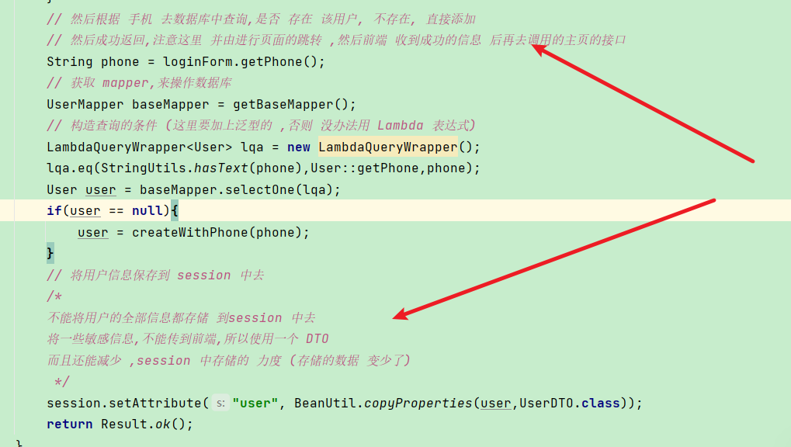
  - 注意一下，在手机号验证码登录的过程中，前端都发起了哪些的请求


- 登录校验的细节
  - 这里并没有使用filter ，而是使用的interceptor ，这里不仅重写 preHandler 而且还重写了 controller处理完成的之后的方法，就是为了释放ThreadLocal 存储的 数据，防止内存的泄露。
  - 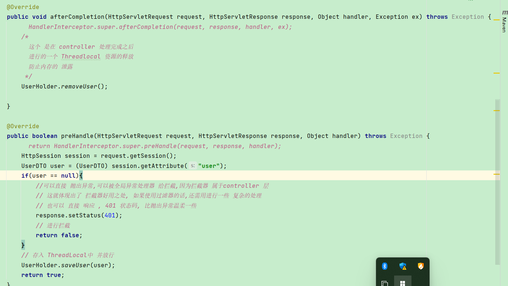
  - 而且这里选择很多，可以直接 抛出异常，或者向上面这样处理都行，抛出异常，因为interceptor 归属于 controller所以全局异常处理器可以直接 捕获，并处理，但是filter 的话，就做不到了。
  - 下面是有添加了一个 拦截器，可以将上面这个拦截器的操作，再简化一些 ，提到 下面这个拦截器中去
  - 这个是refreshTokenInterceptor
  - 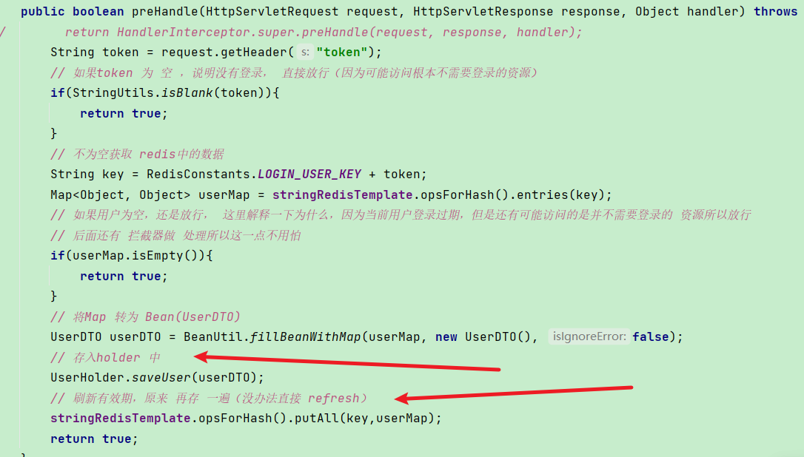
  - 拦截器的细节
  - 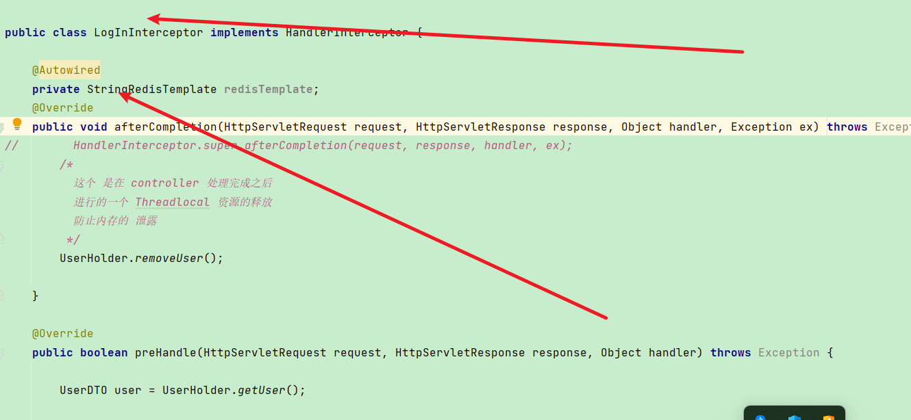
  - 注意这个拦截器是没有被注册为bean 的所以这样写，AutoWired 肯定是失败的，因为你不是spring容器的bean就没人帮你注入 了，所以如果需要的话， 就需要再构造器中把 需要的对象，直接传进来，谁调的谁穿，这就非常好。


- 基于redis 的session方案更加的妙

  - 这整个流程一定要十分的熟悉
  - RefreshTokenInterceptor 的 权重 order 是最优先而且是拦截所有的controller路径的

  - 


- 一些 在存储redis 时用到的细节

```java
    // 生成一个 token ，这里就不用 jwt ，直接用 uuid
        // jwt 能实现跨 服务器共享 ，redis 也可以，在登录方面 用jwt 的话好像就用不到redis 了
        String token = UUID.randomUUID().toString();
        // 将userDTo 转成map 存储（使用map内存 最优） ，将 userDTO json化存储也行，但是内存消耗比map大
        UserDTO userDTO = BeanUtil.copyProperties(user, UserDTO.class);

        // 为什么 整一大串
		// 因为 这里使用的 时StringRedisTemplate, 默认的 key 和 value 都是字符串
/* 但是userDTO 中 id 是Long类型,所以 不这样写的话 会 报 类型转换错误
	也可以有其他的方式,
    ①, 直接 将对 userDTO 转为 json 存储,这样就没问题了,但是内存占用比存储 map结构占用大
   说到底还是序列化的问题,只要把序列化和反序列化 搞清楚的话,这些理解起来就非常的简单了!
   **  网络传输 和数据底层存储 都是字节 **
*/
        Map<String, Object> userMap = BeanUtil.beanToMap(userDTO, new HashMap<>(), CopyOptions.create().
                setIgnoreNullValue(true).setFieldValueEditor((filedNmae, filedValue) -> filedValue.toString()));
        // 存入redis中
        redisTemplate.opsForHash().putAll(RedisConstants.BLOG_LIKED_KEY + token,userMap );
        // 对于hash 结构redis 没办法直接 设置expire ，还需要再写一次
        redisTemplate.expire(RedisConstants.LOGIN_USER_KEY + token,30, TimeUnit.MINUTES);

```


#### Hutool工具包

- hutool工具包（好用）（有时间可以专研一下他们的实现代码学习一下！）
  - RandomUtil
  - BeanUtil（功能超全的）
  - beanToMap
  - fillBeanWithMap
  - JsonUtil（这个 Util 使用的 是什么 序列化工具 FastJson ？）
  - BooleanUtil中的方法可以自动判断自动拆箱,或者装箱时出现的空指针异常!
  
  


#### 缓存问题

- 这可能是redis，受重用的一个点

- 注意 两类缓存
  - 经常变化（商品的详情）
  - 长时间不变的（shopType）


##### 查询数据

- 解释一下从redis 查询到的缓存就是 json 数据，但是为什么不直接封装Result.ok(json ) 返回而是再转为 Bean 对象 再封装Result.ok(bean);

```java
 Shop shop = new Shop();
        shop.setId(10L);
        shop.setAddress("egoandtoo");
        String s = JSONUtil.toJsonStr(shop);
        System.out.println(s);
        Result ok = Result.ok(s);
        System.out.println(JSONUtil.toJsonStr(ok));
        System.out.println(JSONUtil.toJsonStr(Result.ok(shop)));

// 下面是上面的打印展示的结果!
{"address":"egoandtoo","id":10}
{"data":"{\"address\":\"egoandtoo\",\"id\":10}","success":true}
{"data":{"address":"egoandtoo","id":10},"success":true}

这一下就看出了 对吧


```


- 缓存shop-type (这个更值得缓存,因为这个的变化 ,很小)
- redis 中其他的数据结构的 api 还是要熟悉一下的!
  - 两种方式.(要排序)
  - ① redis 使用 key  : list 的存储结构
  - ② 还是使用 key : value ,只不过把 list 结构直接 convert  json 串, 再存储


##### 操作数据(数据的同步  (redis 中和 数据库中数据同步))

- 方案是,先操作数据库再删除 redis缓存
- 保证这个过程的一个原子性!用事务来处理

```java
    @Override
    @Transactional
    public Result updateShop(Shop shop) {
        // id is null
        if(shop.getId() == null){
            return Result.fail("id 不能为 空！");
        }
        // update database
        updateById(shop);
        // 再删除 redis
        stringRedisTemplate.delete(CACHE_SHOP_KEY + shop.getId());
        return Result.ok();
    }

// 只要当前这个方法里面出现了 异常, 数据库就会回滚, 然后抛出异常!
异常 可能: 
①更新数据库
②redis删除key
③else    


```


##### 缓存穿透

- 当前代码采用的是缓存空对象(编码很简单,理解流程就明白了)


##### 缓存雪崩

-  这个的可以先按照简单的方式实现就行了
- 涉及的内容是比较多的

这里面的一个细节点：

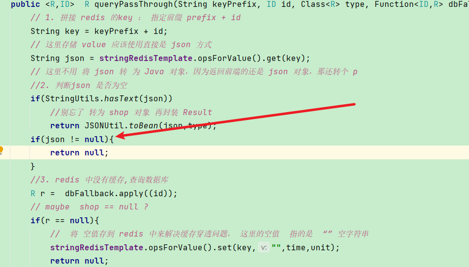

注意这里红线所指的地方， 这里是在 判断什么，我们把 数据库中不存在 的 id 直接 把 空值 存储到redis 中

所以经过上面的判断之后，说明 json 值 没有 text ，那有两种的情况

1. json == null ，说明 redis 没有该id 的缓存
2. json 是 “” 空字符串，说明这个 id 是无效的id ，而且在redis 是已经做了 缓存的

所以起初的 代码 判断 

if（json.equals("")） reutrn null

这是错误的写法, 不测的话还真发现不了


##### 缓存击穿(产生的原因要十分的清楚)(热点 key 问题)

- 这个实现起来有点复杂
  - 两种解决方式


- 互斥锁的实现

  - 这个互斥锁是通过 .redis来实现的,redis的 setnx ,对应着  api 为 setIfAbsent 方法

  ```java
  
  // 尤其 DoubleCheck
  
  
   // 缓存的重建
          // 注意一下 ， lockKey 和 店铺的 key 不是一个key 这点要注意
          String lockKey = RedisConstants.LOCK_SHOP_KEY;
          Shop shop = null;
          try {
              boolean lock = tryLock(lockKey);
              // 获取锁失败，说明 有线程 再做缓存重建，那我就等一会，再 去 查缓存 ，有没有
              if(!lock){
                  Thread.sleep(50);
                  // 休眠之后，再去 执行递归， 注意这个递归
                  return  queryPassThroughMutex(id);
              }
              // 获取锁成功，但是 再去redis 查一遍缓存，因为这可能是，缓存重建已经完成，释放了 suo，才使此时获取锁成功，
              //那这样的话，那就不需要在进行 缓存的重建了 简称 DoubleCheck
              json = stringRedisTemplate.opsForValue().get(key);
              if(StringUtils.hasText(json)){
                  return BeanUtil.toBean(json,Shop.class);
              }
              if(json.equals("")){
                  return null;
              }
  
              //3. redis 中没有缓存,查询数据库
              shop = getById(id);
              // maybe  shop == null ?
              if(shop == null){
                  //  将 空值存到 redis 中来解决缓存穿透问题， 这里的空值  指的是  “” 空字符串
                  stringRedisTemplate.opsForValue().set(CACHE_SHOP_KEY + id,"",CACHE_NULL_TTL,TimeUnit.MINUTES);
                  return null;
              }
  
              //exist ,save in redis
              // bean convert to json
              json = JSONUtil.toJsonStr(shop);
              // 这里注意一下没有设置过期时间！ 设置上过期时间
              stringRedisTemplate.opsForValue().set(CACHE_SHOP_KEY + id,json,RedisConstants.CACHE_SHOP_TTL, TimeUnit.MINUTES);
          } catch (InterruptedException e) {
              e.printStackTrace();
              // 把异常 抛出
              throw new RuntimeException();
          }finally {
              // 释放锁，产生异常也要释放锁
          }
          return shop;
  
  ```

  

- 逻辑过期的实现

  - 怎么把 逻辑过期的信息存入到redis 中,又不修改源代码

    - 在shop 实体类中 添加 expireTime 的字段,但是这样修改了源代码
    - 再套一层,(没有什么问题 是再 封装 一层 解决不了的!)

    ```java
    public class RedisData {
        private LocalDateTime expireTime;
        private Object data;
    }
    //再多添加一层 数据封装,而且拓展性更强!
    
    ```

  - 下面这一点要注意 一下:

  ```java
      RedisData redisData = JSONUtil.toBean(json, RedisData.class);
          LocalDateTime time = redisData.getExpireTime();
          // 这里需要注意一下， 等下注释一下
          JSONObject data = (JSONObject) redisData.getData();
          R r = JSONUtil.toBean(data,type);
  
  // 因为 RedisData中 是Object 类型, 所以在反序列化的时候,并不知道 Data是什么类型
  但是这个工具类 会返回 一个 JsonObject 类型,然后我们再 将JsonObject 转成,具体的类型
      比如这里的 Shop.class
  
  ```

  

  

  - 以上使用的 lock 为什么 不用， jdk 的锁， 就是 syschronize 或者 ReentrantLock 

  因为，这些 锁， 在使用的 时候，不能灵活的 控制，使用通过 redis 实现的 锁，可以灵活根据

  业务逻辑的需要 进行控制！
  
  
  
  - 开启线程的时候使用的是线程池!(并发相关的知识!)


##### 全局唯一ID

- 时间戳  + 自增序列

```java
在redis 中 如果使用
   ** : ** 进行分割的 话,在redis 存储的时候是会 自动分层 (具有层级 关系)
       
     // 使用 redis 自增策略
        /*
        如果 自增 key值 不存在的话，会给当前的 key 初始一个默认的值 0
        所以 不用担心 key  不存在的情况！
         */
        // 在拼接一个日期的话， 这个 日期的作用真的非常的大
        String date = now.format(DateTimeFormatter.ofPattern("yyyy:mm:dd"));
        Long increment = stringRedisTemplate.opsForValue().increment("icr:" + keyPrefix+ ":" + date);
        // 拼接返回    
	所以 上面 key 拼接之后的显示形式 为 icr:业务:2022:12:25
        这样的话可以很方便的统计,某个业务,某个时间段的下单情况!
    
        
        
     现在出现了一个 问题， 就是  不同的业务 订单 使用的 是 不同的 业务订单表，
        但是对于 电商项目， 的订单表， 可不是 这样的 ？
        
```


#### 优惠券秒杀下单

- 首先要明白 优惠卷 和 秒杀卷的 关系，公用一个主键，秒杀卷前提是一个 优惠卷，只是多了一些字段，这些字段又重新弄了一张表来记录


##### 超卖问题

- 高并发的场景下，很容易会出现这种库存超卖的问题

先看一下出现超卖的代码

```java
 涉及到多条 sql 语句的执行的时候一定要 使用事务 来控制的


        //2.1 扣减库存
        
        seckillVoucher.setStock(stock - 1);
        /*
         下面这个 判断 有没有必要的,
         考虑到  并发 的情况嘛!
         */
        boolean success = iSeckillVoucherService.updateById(seckillVoucher);
        if(!success){
            return Result.fail("库存不足!");
        }
// 高并发的场景下 上面的代码 是有 很大问题
1. 首先, seckillVoucher 对象 封装 了 当前 seckillVoucherId 对应的 那一条数据
    但是注意这个 已经 在内存中了,假设 此时的 库存 stock = 10
    执行 上面的代码 就是 stock = 9 ,然后根据 voucherId 去更新数据库,但是问题就出现这里
    你还能确定数据库 中 的 stock 是 10 吗 ?
    我们在 数据库执行的代码 应该是 stock = stock - 1 ,而不是 set stock = 9
    这两个 的意义 完全不一样的!, 这一点一定要十分的注意

2.所以代码 要这样写 (而且一定要这样写)    
   boolean success = iSeckillVoucherService.update().setSql("stock = stock - 1")
                .eq("voucher_id", voucherId).update();
        if(!success){
            return Result.fail("库存不足!");
        }
    
3. 即使是按照上面这样写,仍然在 高并发的情况下会出现超卖情况
    - 1. 加锁, 同步代码块, 或者 lock (力度太大,性能差)(悲观锁)
    - 2. 乐观锁 
    	- 1.版本号法, 2. CAS compare and set (switch)
这里实现采用 CAS    
    新版本的代码 // 相当于 把 stock 字段当作 版本号来用了
    
       boolean success = iSeckillVoucherService.update().setSql("stock = stock - 1")
                .eq("voucher_id", voucherId).eq("stock",stock).update();
        if(!success){
            return Result.fail("库存不足!");
        }

4.上面代码的实现,还是有问题的,只要发现 版本号(stock )不一致,直接返回了,并不会完成下单
    所以很多的下单请求都是失败.
    因为 stock 的特殊性 我们可以直接让 stock > 0 即可
    // 希望你 再次看到这些文字的 时候,已经有了更深刻的理解!
    
    
    
// 如果不是 stock 这种的特殊性的 话,还可以 使用 分段锁的思想    

```


##### 一人一单

- 从哪些方面去思考 这个一人一单? 
  - 用户再下完单之后会留下 哪些 痕迹呢? 订单中 有当前用户的 标记,如果当前用户已经下过单,那么肯定在数据库中是可以查到的订单的,

```java

       // 在 判断过 时间之后,再去 判断 当前用户, 有没有 下过单
        long userId = UserHolder.getUser().getId();
        // 去查询, 有没有当前用户的订单
        QueryChainWrapper<VoucherOrder>  qw = query().eq("user_id", userId).eq("voucher_id",voucherId);
// 别忘了判断条件还有voucherId ,是指 某种优惠卷不能重复下单!
// 这是一个细节!
        VoucherOrder one = getOne(qw);
        // 如果 存在, 返回提示信息
        if(one != null){
            return Result.fail("不能重复下单!");
        }

// 这样也可以实现, 但是没必要返回一个 实体类对象,就判断一下存在或者不存在就行了


-- 更正后的逻辑
    
          long userId = UserHolder.getUser().getId();
        // 去查询, 有没有当前用户的订单
        Integer count = query().eq("user_id", userId).eq("voucher_id", voucherId).count();
        // 如果 存在, 返回提示信息
        if(count > 0){
            return Result.fail("不能重复下单!");
        }
注意使用count() 就相当于 执行了不用再写其他的了
    
    
    
    
// 这样还是存在,并发问题, CAS 比较适合 更新操作 加锁, 
    
    // 这一个功能的实现真的是细节太多了
    p54 这节 视频真的 能学到很多的东西
    
    1. spring事务的 原理, 动态代理, 以及 spring管理事务的 几个比较常见,失效的情况
      
   		 - 现在的问题  A 方法调用了 B方法, 在 A 方法上加上事务注解 ,会发生什么
    	 -	 测试发现 b 方法 也具有 事务了，如果 b方法中有 sql语句的执行，那么出现异常之后
         都会 回滚的 ，其实想象 一下 ，也是理所应当的，因为 在调用 mp的方法的时候，也是相当于在
    A方法中调用其他的 方法 ，都是一样的。
    本质 是 通过spring的 aop 来实现的（动态代理，只要十分的清晰动态代理的话，那么这些，就很容易理解了）
    使用声明式事务 （注解） 的时候 数据库的连接对象，这里面还是大有学问的！
    
    
    
    2. 加 锁,同步代码, 或者 lock 的原理, 同步监视器(对象) 有一 块 区域 ,这又涉及到jvm 的知识了!
    
    3.并发
    
    
    细节:
   1. 在 使用同步代码 块的 时候,一开始 只想在 下面这一部分加锁,但是这样根本
       解决不了 线程并发的 问题,这跟 没加锁,没什么区别!
       ----
        long userId = UserHolder.getUser().getId();
        // 去查询, 有没有当前用户的订单
        Integer count = query().eq("user_id", userId).eq("voucher_id", voucherId).count();
        // 如果 存在, 返回提示信息
        if(count > 0){
            return Result.fail("不能重复下单!");
    -----
    所以加锁的 范围是 整个 createVoucherOrder() 代码
        
        
   2. 同步监视器 (锁对象) 的细节
        这一点解释起来有点复杂,看一下 p54 这节视频 就懂了
        
        
   3. 事务一定要在 锁对象 释放之前提交,否则还是存在线程并发问题.     
    
          synchronized (userId.toString().intern()){
           IVoucherOrderService proxy = (IVoucherOrderService) AopContext.currentProxy();
            return proxy.createVoucherOrder(voucherId, userId);
        }
    
    
    
    -- 
        同一用户的 并发操作!(解决的是这个问题)
    
```


##### 分布式锁(非常牛逼)  现在可能看不太懂, 之后要来回看这些得章节,非常的牛逼 (再结合 java并发编程的知识可以对这些有一个更深入的认识)

- 由一人一单业务,集群 线程并发问题,引出的分布式锁的知识
- 同一用户的并发操作

自己实现分布式锁,是为了熟悉这个过程,和原理

这也十分的重要


-  使用别人提供的分布式锁的工具 Redisson 工具

- 可重入锁
  - 实现起来是有些复杂的说实话
  - 果然并发编程,是比较难得

- 锁重试


**可以尝试 自己动手 实现一下 这个  分布式锁! **

**并发编程** **还是很重要**


#### 演示spring事务

1.  在spring项目中 数据库 connection 对象 是 谁创建的! 
   1. 加上 @Transactional  数据库连接对象 是spring 创建的,那 不加 这个注解的话,是 mybatis创建的吗?
2. [01.什么是事务_哔哩哔哩_bilibili](https://www.bilibili.com/video/BV1Eq4y1R7Ds?p=1&vd_source=179da737184de5a8f84e4f6c2ee5c350)
3. 事务失效的演示!
4.  spring事务还是 大有学问的！
5.   spring事务的 是通过 AOP 来实现的， 那么 就会创建代理对象， 怎么获得（aop 创建）代理对象，

如果 调用 被代理 对象的 方法， 是不会被 事务所管理的！（这里涉及的未知的 知识点，还是挺多的！）

- 对下图 进行 思考!

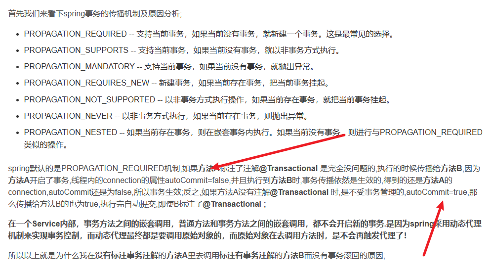

===

还有 一种 事务的 应用场景, 就是 

这种 也 最好 加个 事务,  如果 存在  **同成功, 同失败 的场景** ,那就需要 使用 事务!

@Transaction

function(){

​		mysql 操作;

​		redis 操作!

}


#### 消息队列（将 秒杀的 业务， 进行拆分）

这个 功能  的实现， 真的 可以学到 很多的东西在里面，

还有 消息 队列的 一个 演化，（redis 来 实现， 明白一下 消息队列的 实现的  一些区别）

和 市面上一些 常见的 消息队列的 ，各种模式


== 

这个 实现的 还是 比较强大的！（有很多的知识点， 在这里面）

==

首先在 服务器上装上 redis 的 服务端 和 客户端， 进行 实操 啊

这个是 少不了的环节！


==

Lua 脚本语言的 编写 ，好像也是少不了的！


== 

下面 这个图 可以 对 Stream 的数据 结构 ，有一个 深刻的 理解！

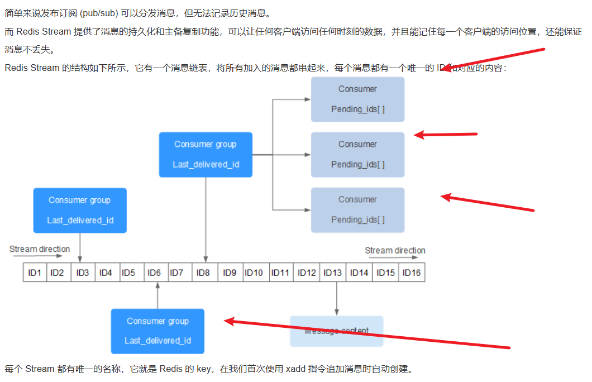


#### 达人探店

主要是redis ，相关 数据结构的 使用！

刚开始 ，只要求 元素 唯一 ，当然可以使用 set

（根据业务的需求， 进行一个数据结构的选择）

但虽然 代码的编写 ，发现还需要 ，对 点赞的 用户的 展示的 

进行一个 排序 后展示 top N 名 ， 这个时候还需要根据响应规则 进行一个排序，

所以这个时候使用 SortedSet  比较的 合适


-  果然 mp 要比 你想象 的 更强大！

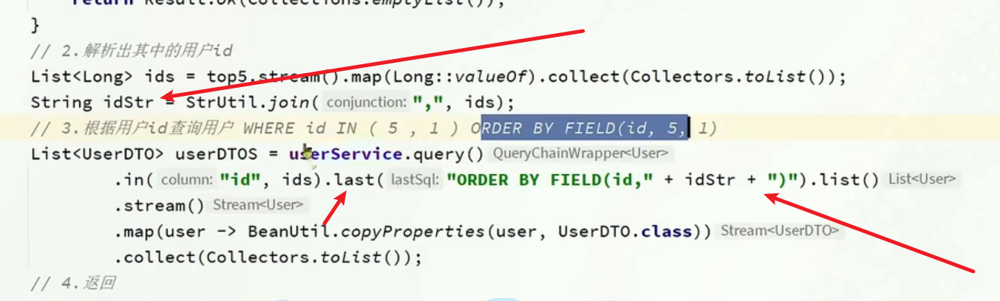


==

熟练的 掌握以下 Mp的 相关api  和 myql 相关语句的 映射

以及Mp api 的强大功能！


#### 关注相关功能（还学到的 一个 经验  就是， 无论 在使用 什么 之前 ，先考虑一下  null 值 和 空值）


##### 关注 和取关（ 关注对方的 话，是不是可以  推送 一个消息 来通知 被关注的 人（就是 查看 谁 关注了 自己））

（从关注的 角度来看， 用户和 用户之间是）多对多 的关系， 所以 需要 一张中间表


##### 共同关注


==

 可不可以 从 数据库 层面，来解决 这个 共同 关注 （ 两个 用户 关注 列表的 交集）

从已知的 mysql 的知识来看，这点是可以做到的（ 复习 mysql）


==


##### 关注推送


==

 任何 的 数据 库的 操作 完成 之后，都要 判断 一下吗？（就像下面  这样的 严谨！）

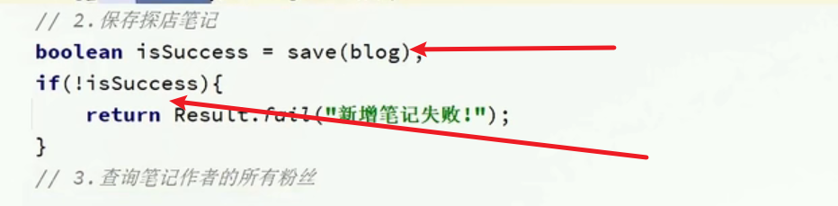


==

（这个 可以 采用数据库 表的 来存储  邮件 （同送的 消息））实时性 比较差

只有 用户 点击邮件的 时候，才会去 数据库中查询

==

采用 实时 通讯 的方式 ，一旦 推送，就会通知 关注者，


==

Feeding流


==

感觉 这样  设计 更加 合理

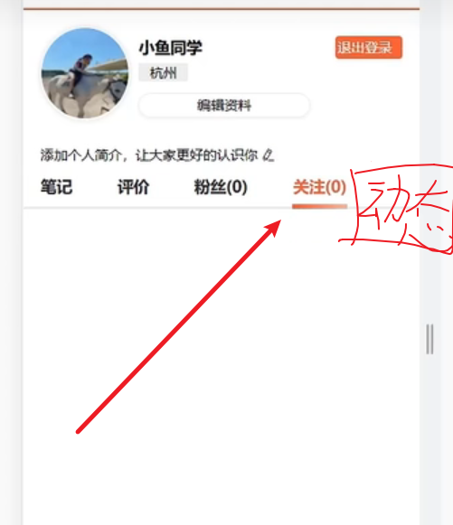

关注 的话， 只显示， 自己的 关注

而动态 才会去 显示， 自己 关注列表的所发的动态（按照时间排序）（使用redis 实现的）


==

 太牛了， 这个 必须要 亲手 实践（ 这个 项目 本身而言， 就非常的牛逼！） 


##### 附近商铺（Geo

- [x] 

 利用redis 提供的 数据结构，来实现 这个功能， 主要 是 redis 相关数据 api 的使用

这里可以 直接 根据 idea 的 api 参数的 提示,去思考, 相关 api  的 作用和功能

同时 也 得理解 redis 中Geo 数据 结构 的相关 操作!

```java
@Test
void loadShopData() {
    // 1.查询店铺信息
    List<Shop> list = shopService.list();
    // 2.把店铺分组，按照typeId分组，typeId一致的放到一个集合
    Map<Long, List<Shop>> map = list.stream().collect(Collectors.groupingBy(Shop::getTypeId));
    // 3.分批完成写入Redis
    for (Map.Entry<Long, List<Shop>> entry : map.entrySet()) {
        // 3.1.获取类型id
        Long typeId = entry.getKey();
        String key = SHOP_GEO_KEY + typeId;
        // 3.2.获取同类型的店铺的集合
        List<Shop> value = entry.getValue();
        List<RedisGeoCommands.GeoLocation<String>> locations = new ArrayList<>(value.size());
        // 3.3.写入redis GEOADD key 经度 纬度 member
        for (Shop shop : value) {
            // stringRedisTemplate.opsForGeo().add(key, new Point(shop.getX(), shop.getY()), shop.getId().toString());
            locations.add(new RedisGeoCommands.GeoLocation<>(
                    shop.getId().toString(),
                    new Point(shop.getX(), shop.getY())
            ));
        }
        stringRedisTemplate.opsForGeo().add(key, locations);
    }
}
```


== 

这段业务的 操作 确实,还是比较繁琐的

主要是在 细节方面 要注意!


##### 用户签到（BitMap）


== 

使用 数据库 存储 来实现

这个实现起来 是有些 夸张的！


==

使用BitMap 来实现

顺便再联系一下  位运算的 相关 技巧


BitMap 是 属于 string group 中的 （也就是 使用string  来实现的 BitMap）

签到功能:

```java
 /**
     *  签到 功能的 实现！
     */
    @Override
    public Result sign() {
        // get user_id
        Long id = UserHolder.getUser().getId();
        LocalDateTime now = LocalDateTime.now();
        String format = now.format(DateTimeFormatter.ofPattern(":yyyy:MM"));
        int dayOfMonth = now.getDayOfMonth();
        String prefix = "sign:"; // 指定一个 前缀， 根据 个人的 业务需求 去 思考 这种写法
        Boolean aBoolean = redisTemplate.opsForValue().setBit(prefix + id + format, dayOfMonth - 1, true);
        /*
         只要 存在 返回结果的 情况， 就需要 进行 一个
         非空的 判断！ （养成 一个好的习惯）
         */
        if(BooleanUtil.isTrue(aBoolean)){
            return Result.ok();
        }
        return Result.fail("unkonwn error!");
    }
```


连续登录天数:

这里的计算,是从 当前天, 向后计算!

这里面的非空 判断的 细节 有很多! (但是 有些 地方 需不需要 这些判断 呢!)

```java
    @Override
    public Result successiveSing() {
        // userid
        Long id = UserHolder.getUser().getId();
        //current day
        LocalDateTime now = LocalDateTime.now();
        //redis key
        String key = RedisConstants.SIGN + id + now.format(DateTimeFormatter.ofPattern(":yyyy:MM"));
        // obtain a value
        List<Long> longs = redisTemplate.opsForValue().bitField(key,
                BitFieldSubCommands.create().get(BitFieldSubCommands.BitFieldType.unsigned(now.getDayOfMonth())).valueAt(0));

        // 返回的 一个 集合， 就是 意思 不只  get 的结果， 但其实 我们 是 知道的 ， 我们就是 get 操作，（ 该 命令 ，可以 有多个 操作）
//        assert longs != null;
        if(longs == null || longs.isEmpty()){
            // 签到的结果 为 0
            Result.ok(0);
        }
        Long sign = longs.get(0);
        if(sign == null || sign == null){
            return Result.ok(0);
        }
        // 开始 从 这个 十进制 中， 找到 连续签到的 天数， 采用位运算；
        Integer count = 0;
       while((sign & 1) != 0){
           count++;
           sign >>= 1;
       }
        return Result.ok(count);
    }

```


==

对比 一下 ，使用BitMap 的 优势 在哪里，

redis 中 BitMap 数据结构的 使用的相关功能，其实 Integer 类 中差不多 都实现了！


===

使用redis 提供的 bitMap 来 大致 实现 和 熟悉 一下 布隆过滤器


布隆过滤器的 相关 参数的 公式 (大致的 流程 ,就是 先算 m 再算 k , 在计算真实的 p)

m : bitMap 的 大小

k: 哈希函数的 个数

p : 失误率

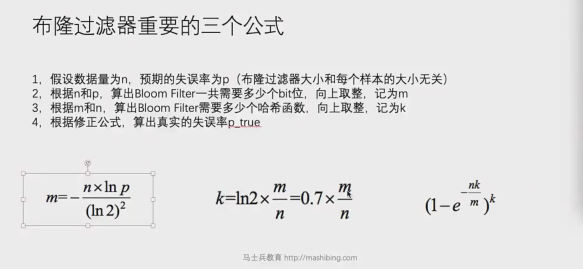

第三个 公式 是计算 真实的 失误率 p 的公式


只要 知道 两个 哈希函数, 可以 得到任意个 哈希函数


== 看到这里的时候, 还要去 掌握 一下一致性哈希!


==

顺便 熟悉 一下 LocalDateTime  api 的相关使用！


##### UV 统计（HuperLogLog）

这个 知道 怎么 个回事 先， 等 实习 之后，再来 搞定这个！


#### 网络模型


##### 首先 要明白 用户态 和 内核态

[用户空间和内核空间的区别 - 知乎 (zhihu.com)](https://zhuanlan.zhihu.com/p/343597285)

上面这个 链接 做了一个 小小的 解释

但是还是需要 对 计算机组成原理 复习 一下， 否则 还是有点抽象的！


##### 五种 网络模型


##### redis 常用的数据结构 和 使用的场景


而且  对 redis 的 一些 底层存储的结构， 进行 了一定 的讲解！

- [(88条消息) redis专题：redis的常用数据结构及使用场景_知识分子_的博客-CSDN博客_redis数据结构使用场景](https://blog.csdn.net/qq_45076180/article/details/109458668)


##### redis 相关学习的教程（中文教程网站）

RUNOOB.COM

在这上面不知可以学到redis ， 还可以学到 其他的 很多知识！

当然 这里 主要 是， 学习 redis 的 新的 数据结构 stream  and  GEO

- [Redis Stream | 菜鸟教程 (runoob.com)](https://www.runoob.com/redis/redis-stream.html)


####   springboot官方不推荐 使用 @Autowired 进行属性注入！


这需要 对 JVM 的知识 进行复习

并且 对spring Bean的 加载 有了解

[为什么Spring官方不推荐使用@Autowired属性注入_哔哩哔哩_bilibili](https://www.bilibili.com/video/BV1FD4y1N7dQ/?spm_id_from=333.1007.tianma.1-1-1.click&vd_source=179da737184de5a8f84e4f6c2ee5c350)


- redis 常用的数据结构， 以及 使用场景

[(88条消息) redis专题：redis的常用数据结构及使用场景_知识分子_的博客-CSDN博客_redis数据结构使用场景](https://blog.csdn.net/qq_45076180/article/details/109458668)


- 一文 吃透  微服务的 网关， 服务注册&发现

[一文吃透何为微服务、网关、服务发现/注册？ - 文章详情 (itpub.net)](https://z.itpub.net/article/detail/834826A6B40C46D20AC16A7D86CB7A03)


